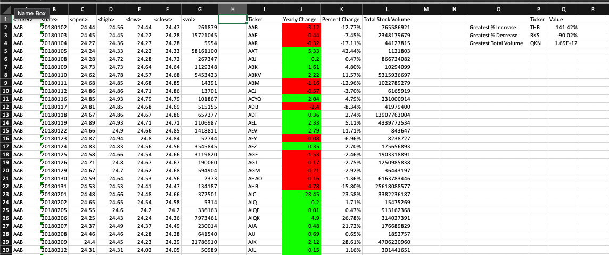
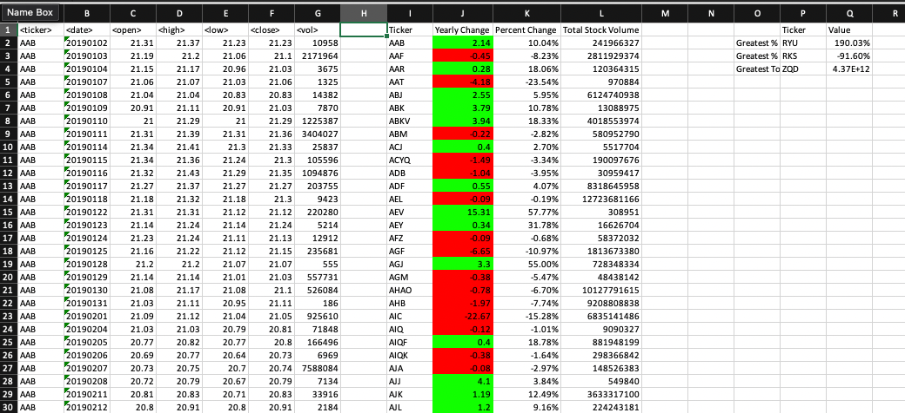
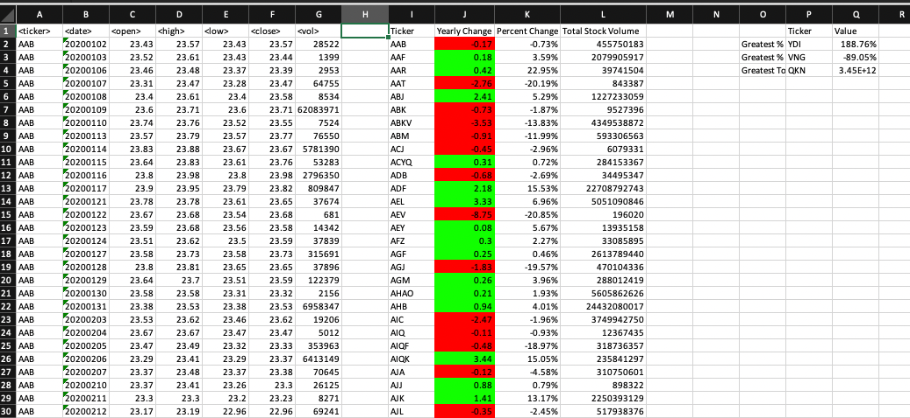

# VBA-challenge

## Purpose

The goal of the Bootcamp Module 2 Challenge is to create a script that loops through all the stocks (from the Multiple_year_stock_data Excel File) for one year and outputs the following information:

- [X] The ticker symbol.

- [X] Yearly change from opening price at the beginning of a given year to the closing price at the end of that year.

- [X] The percent change from opening price at the beginning of a given year to the closing price at the end of that year.

- [X] The total stock volume of the stock.

- [X] With conditional formatting highlighting positive change in green and negative change in red.

- [X] A second summary table showing the Greatest % increase, Greatest % decrease, and Greatest total volume.

## Overview

In the end a summary table is needed:

|I|J|K|L|
|:-:|:-:|:-:|:-:|
|Ticker| Yearly Change | Percent Change | Total Stock Volume |

Yearly Change is the closing price at the end of the year minus the opening price at the beginning of that year.

Percent Change is the Yearly Change divided by the opening price at the beginning of the year.

Total Stock Volume is the total of the volume column for that ticker.

And a second summary table is needed:

|O|P|Q|
|:-:|:-:|:-:|
| | Ticker | Value |
|Greatest % Increase
| Greatest % Decrease
| Greatest Total Volume

Greatest % Increase is the maximum from the Percent Change column.

Greatest % Decrease is the minimum from the Percent change column.

Greatest Total Volume is the maximum from the Total Stock Volume column.

## Results

Here are the screenshots for 2018, 2019, and 2020:

The results were obtained using the VBA script found in `Script.vba`
